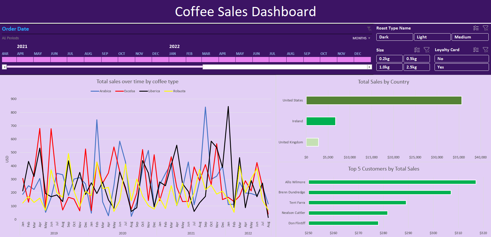

# Coffee Sales Analysis

This project is an analysis and visualization of Coffee orders sales of a chain that operates in the USA, Ireland, and and the UK.

The business questions the stakeholders want addressed are:
1- What was the sales over the past 3 years like?
2- What market did we perform best in?
3- Who are our top customers?

The data is in the form of 3 sheets:

- `orders`
- `products`
- `customers`

The data was cleaned and merged to create a single dataset that was used for the analysis and visualization.
We answered these questions and created an interactive dashboard for easier exploration

